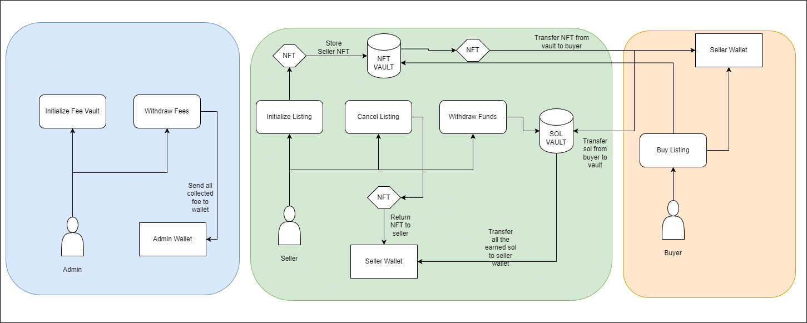

# Troofi

Troofi is a NFT marketplace built on Solana, designed to make listing, discovering, and trading NFTs fast, fair, and accessible for everyone.

## User Story

Click here to see [User Story](./USERSTORY.md)

## Architecture Diagram


## Functionality

- **NFT Listings:**
    - List NFTs for sale with custom price
    - Cancel existing NFT listing.

- **Purchases:**
    - Buy NFTs from active listing

- **Marketplace Fee Management:**
    - A small fee of 0.25% of the NFT price is collected from each sale.
    - The collected fee goes to maintainace and development of the marketplace

- **Admin Controls:**
    - Only admin can withdraw fees out of vault

## Installation & Setup

### Installation
1. Clone the repository

```bash
git clone https://github.com/Bijoy99roy/Troofi.git
```
2. Install dependencies

```bash
npm install
```

### Testing

1. Setup MPL CORE locally

```bash
mkdir ~/.local/share/metaplex-local-validator
```

```bash
solana program dump -u m CoREENxT6tW1HoK8ypY1SxRMZTcVPm7R94rH4PZNhX7d ~/.local/share/metaplex-local-validator/mpl-core.so
```

2. Run MPL CORE

```bash
solana-test-validator -r --bpf-program CoREENxT6tW1HoK8ypY1SxRMZTcVPm7R94rH4PZNhX7d ~/.local/share/metaplex-local-validator/mpl-core.so
```

3. Test anchor program

```bash
anchor test --skip-local-validator
```

### Contributing

- Fork the repository
- Create your feature branch
- Commit your changes
- Push to the branch
- Open a Pull Request